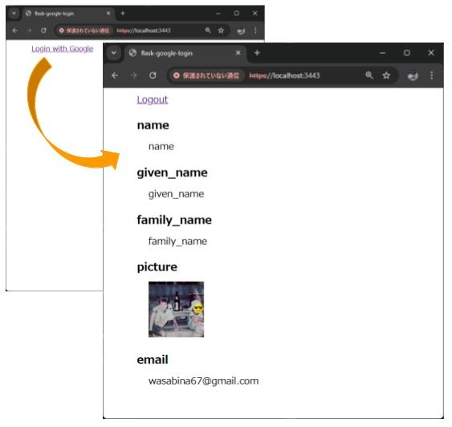

# flask-google-login
Flask Google login

## Setup

- [OAuthLib](https://oauthlib.readthedocs.io/en/latest/)
- [oauthlib/oauthlib](https://github.com/oauthlib/oauthlib)

### Redirect URI

```
https://localhost:3443/callback
```

### Create .env

```bash
cp -p .env.example .env
```

- SECRET_KEY
  - Flask secret key
- CLIENT_ID
  - The client ID for your application registered on the Google Authentication platform
- CLIENT_SECRET
  - The client secret for your application registered on the Google Authentication platform
- GOOGLE_OPENID_CONFIGURATION

## Run

```bash
python src/app.py
```

Open https://localhost:3443/


